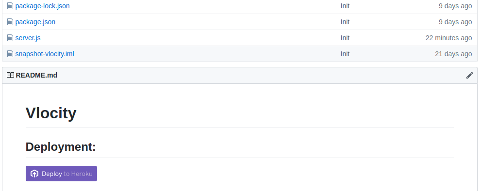
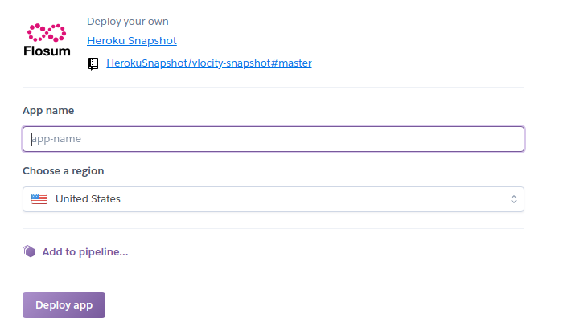
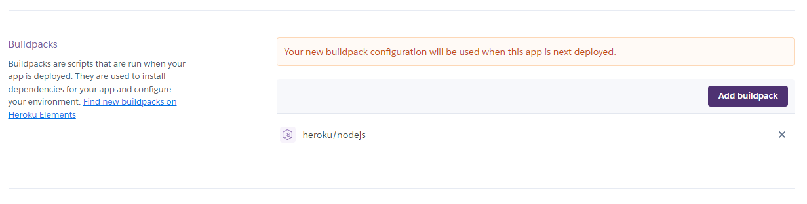
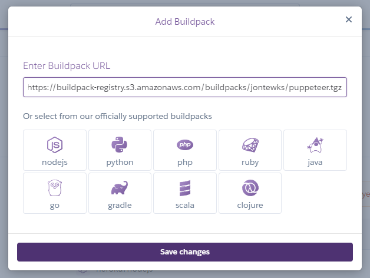
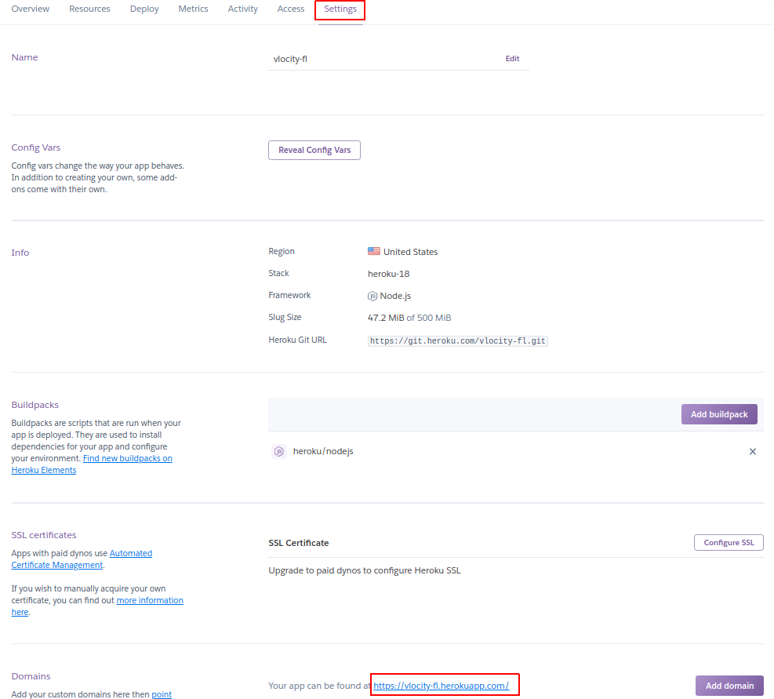
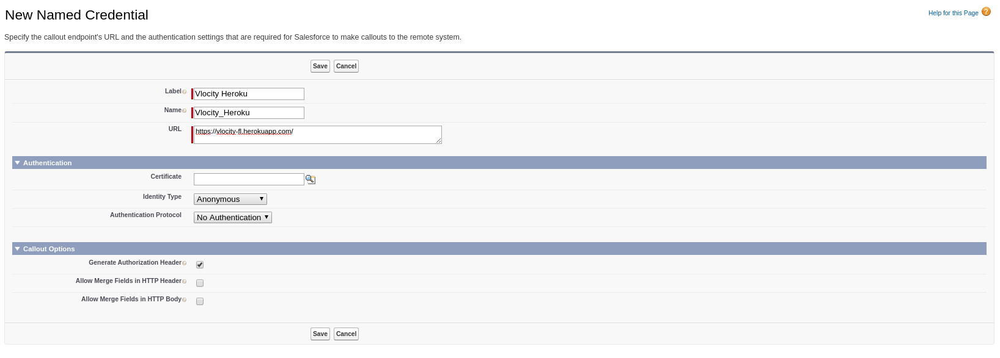
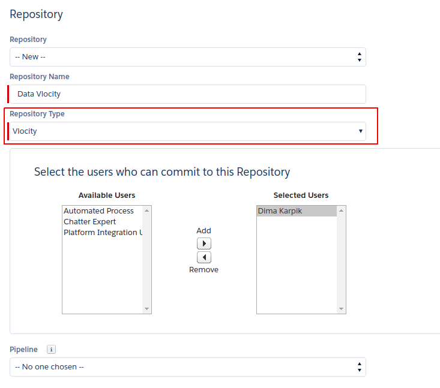

# Vlocity
## Deployment:

## How to configure Vlocity

#### Step 1: Creating the Heroku application
Go to the GitHub account provided by your Customer Success team. 
Go to the repository “Vlocity Snapshot”. 
Click the button "Deploy to Heroku" to deploy the application to Heroku. (See Fig. 1.) 

Fig. 1

 
Enter application name  you want to give to this Heroku app and click the button “Deploy app”.
 

 

 Fig. 2

 
This should result in the successful deployment of the code in the GitHub repository to the Heroku app. 

For LWC auto activation required to add Buildpack for support puppeteer
 
https://buildpack-registry.s3.amazonaws.com/buildpacks/jontewks/puppeteer.tgz

 
#### Step 2: Creating “Named Credentials”
In Heroku, select Name app. Next go to the application settings page and copy the domain. (See Fig. 3.) 

Fig. 3

 
Now in Flosum select the Setup Gear. In the Quickfind box, search for "Named Credenitals". Then you will add a new Named Credential. Name : Vlocity_Heroku.  The URL is the domain that you just copied from Heroku. (See Fig. 4.) 

Fig. 4

 
#### Step 3: Creating repository for 'Vlocity' components. 
In Flosum, select the "Settings" tab. Scroll down until you see the section called “Repository” feature. Fill in all the required fields and select the "Vlocity" repository type. (See Fig. 5.)

Fig. 5

